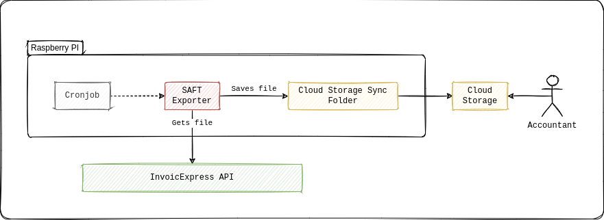

# SAFT exporter for Invoicexpress

## How it works



## Build for Raspberry PI

```shell
env GOOS=linux GOARCH=arm GOARM=7 go build
```

## Copy to Raspberry PI

```shell
scp saft-exporter pi@mypi:~
```

## Adding to crontab in Raspberry PI

Add the following variables to `/home/pi/.profile`:

```bash
export INVOICE_ACCOUNT_NAME="your-invoicexpress-account-anme"
export INVOICE_API_KEY="your-invoicexpress-api-key"
```

Create the `export-saft.sh` file with the following contents:

```bash
#!/bin/bash
./saft-exporter --destination /home/pi/accounting
```

Run `crontab -e` and add the following:

```
# Runs at 00:00 on day-of-month 2.
0 0 2 * * BASH_ENV=/home/pi/.profile /home/pi/export-saft.sh >> /home/pi/export-saft.log 2>&1
```